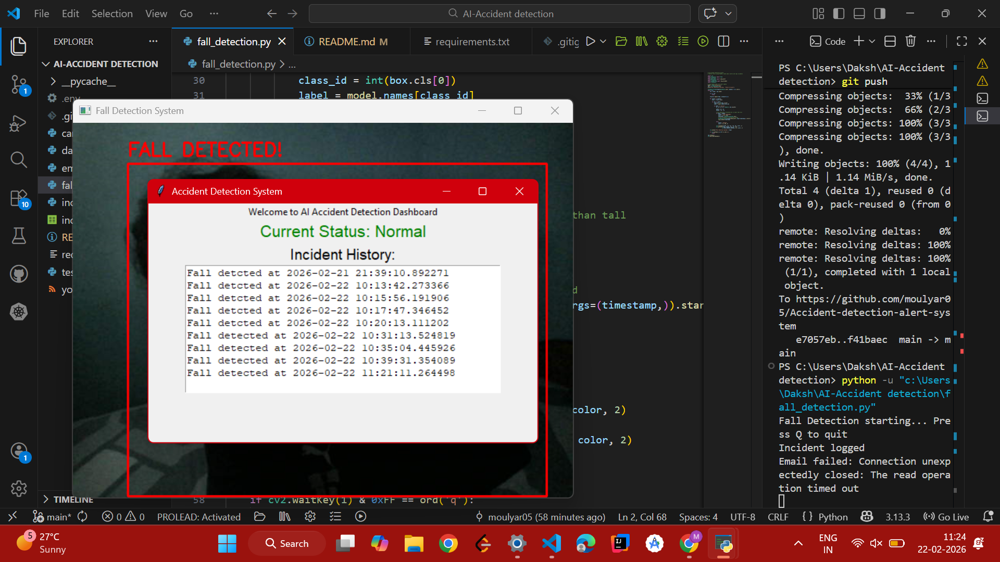

# AI Accident Detection System

A real-time accident detection system that uses AI to detect falls 
and immediately alert concerned authorities — because delayed 
response in accidents can cost lives.

## Features
- Real-time fall detection using YOLOv8
- Automated email alerts on fall detection
- Incident logging with timestamp to CSV
- Live dashboard showing current status and incident history

## Technologies Used
- Python
- OpenCV
- YOLOv8
- Tkinter
- smtplib

## How Fall Detection Works
YOLOv8 detects people in the camera frame and draws a bounding box 
around them. When a person is standing, the box is taller than wide. 
When a person falls, the box becomes wider than tall. 
This width > height logic triggers the fall alert.

## Limitations
- False alerts possible if person falls briefly but recovers quickly
- Requires clear camera view of the person
- Currently detects falls only, not collisions
- Only sends one alert per session

## Future Improvements
- Add timer to confirm sustained fall before alerting
- SMS alerts using Twilio
- Collision detection between multiple people
- Multiple camera support

## Screenshots

## How to Run
1. Clone the repository
2. Install dependencies: `pip install -r requirements.txt`
3. Create `.env` file with your email credentials
4. Run: `python fall_detection.py`

## Project Structure
- `fall_detection.py` - Main detection file
- `email_alert.py` - Email alert handler
- `incident_log.py` - Incident logging
- `dashboard.py` - Tkinter UI dashboard